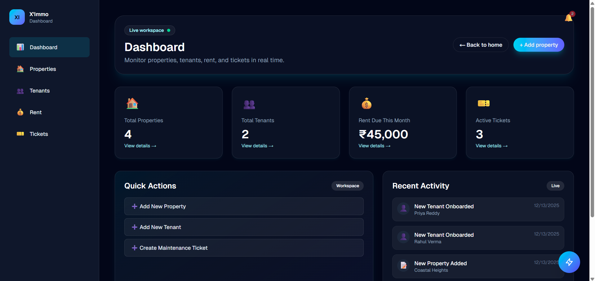
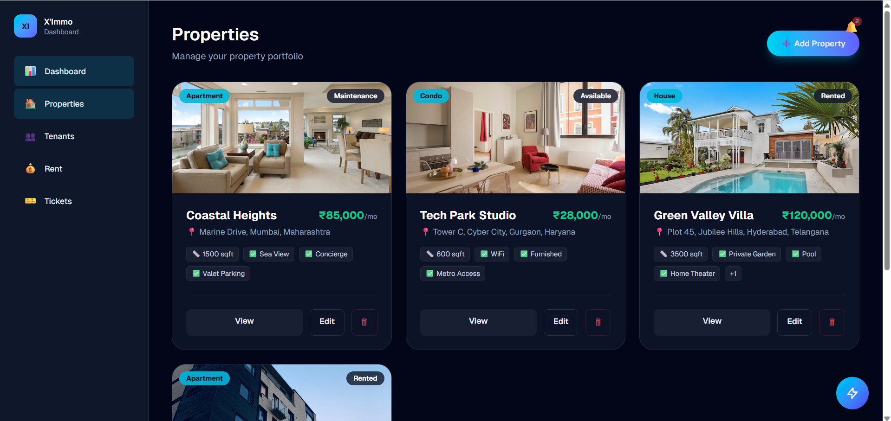
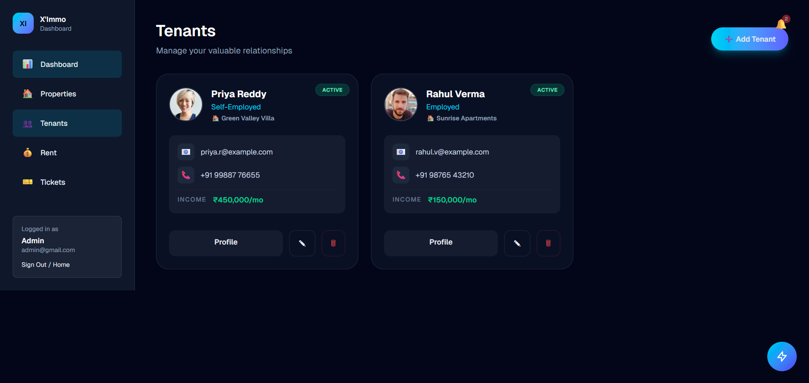
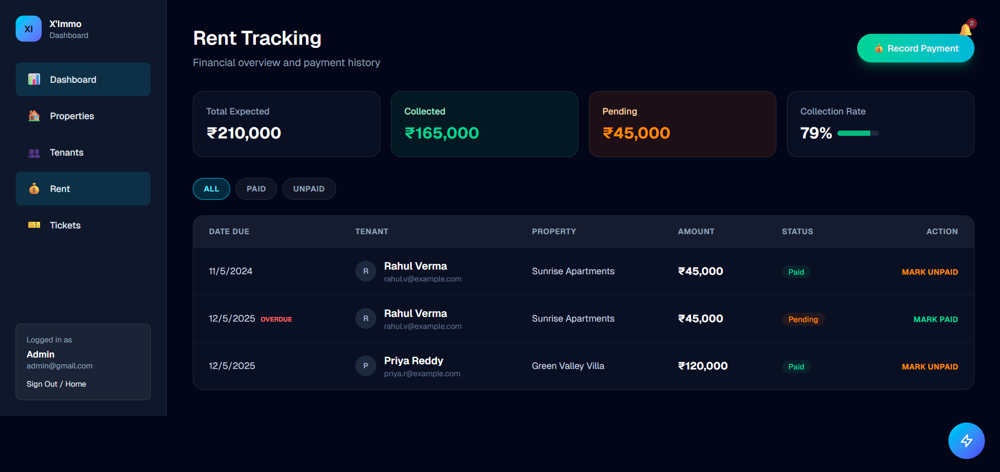
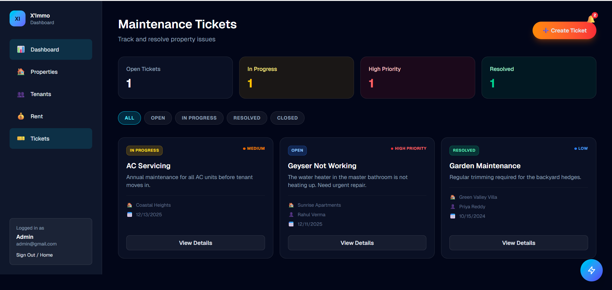

<div align="center">

# 🏢 X'Immo | Smart Property Management Platform

### *Elegant. Intelligent. Effortless.*

**The next-generation solution for modern property management**

[](https://nextjs.org/)
[](https://www.typescriptlang.org/)
[](https://www.mongodb.com/)
[](https://tailwindcss.com/)

[Live Demo](https://your-demo-url.com) • [Documentation](#) • [Report Bug](#) • [Request Feature](#)

</div>

---

## 🌟 Overview

**X'Immo** is a comprehensive, full-stack property management platform designed to streamline the complexities of managing real estate portfolios. From tracking rent payments and managing tenant relationships to handling maintenance tickets and document storage, X'Immo provides a centralized, elegant "Zero Gravity" interface for landlords and property managers.

> [!IMPORTANT]
> **Demo Credentials Available!** Try the platform instantly with our live demo environment.
> First-time login may take 10-15 seconds as the MongoDB server initializes.

---

## ✨ Key Features

<table>
<tr>
<td width="50%">

### 📊 **Smart Dashboard**
Real-time overview of portfolio performance, occupancy rates, revenue tracking, and financial health metrics at a glance.

### 🏘️ **Property Management**
Comprehensive property profiles with image galleries, location data, amenities, and detailed specifications.

### 👥 **Tenant Portal**
Centralized tenant management with lease tracking, document storage, and communication history.

</td>
<td width="50%">

### 💰 **Rent Tracking**
Automated rent schedules, payment history, and status monitoring (Paid, Overdue, Pending) with visual indicators.

### 🔧 **Maintenance Hub**
Complete ticket system for tracking repairs and maintenance requests from submission to resolution.

### 🎨 **Zero Gravity UI**
Stunning, responsive design with glassmorphism effects, smooth animations, and dark mode aesthetics.

</td>
</tr>
</table>

---

## 📸 Platform Showcase

### 🏠 Landing Page
*Modern, engaging homepage with demo credentials and smooth animations*


---

### � Smart Dashboard
*Comprehensive overview with real-time metrics, charts, and quick actions*



---

### 🏘️ Property Management
*Detailed property listings with images, status indicators, and quick filters*



---

### 👥 Tenant Management
*Complete tenant profiles with lease information and contact details*



---

### 💰 Rent Tracking
*Payment history, status monitoring, and automated reminders*



---

### 🔧 Maintenance Tickets
*Ticket management system with priority levels and status tracking*



---

## 🛠️ Technology Stack

<table>
<tr>
<td width="50%" valign="top">

### **Frontend**
- **Framework**: [Next.js 16](https://nextjs.org/) (App Router)
- **Language**: TypeScript
- **Styling**: [Tailwind CSS v4](https://tailwindcss.com/)
- **Data Fetching**: [SWR](https://swr.vercel.app/)
- **Authentication**: JWT & Cookie-based
- **UI/UX**: Glassmorphism, Dark Mode, Responsive Design

</td>
<td width="50%" valign="top">

### **Backend**
- **Runtime**: [Node.js](https://nodejs.org/)
- **Framework**: [Express.js](https://expressjs.com/)
- **Language**: TypeScript
- **Database**: [MongoDB](https://www.mongodb.com/) with Mongoose ODM
- **Authentication**: JWT (JSON Web Tokens) & Bcrypt
- **File Handling**: Multer for uploads
- **Validation**: Express Validator

</td>
</tr>
</table>

---

## 🚀 Getting Started

### Prerequisites

Ensure you have the following installed:

- **Node.js** (v18+ recommended)
- **npm** or **yarn**
- **MongoDB** instance (local or [MongoDB Atlas](https://www.mongodb.com/cloud/atlas))

### 📦 Installation

#### 1️⃣ Clone the Repository

```bash
git clone https://github.com/yourusername/ximmo.git
cd ximmo
```

#### 2️⃣ Backend Setup

Navigate to the backend directory and install dependencies:

```bash
cd backend
npm install
```

Create a `.env` file in the `backend` folder:

```env
PORT=5000
MONGO_URI=your_mongodb_connection_string
JWT_SECRET=your_jwt_secret_key
NODE_ENV=development
```

Start the backend server:

```bash
npm run dev
```

> [!NOTE]
> The backend will run on `http://localhost:5000`

#### 3️⃣ Frontend Setup

Open a new terminal, navigate to the frontend directory:

```bash
cd frontend
npm install
```

Start the frontend development server:

```bash
npm run dev
```

> [!TIP]
> The application will be available at `http://localhost:3000`

---

## 🎯 Usage

### Demo Credentials

Try the platform with our demo account:

- **Email**: `admin@gmail.com`
- **Password**: `admin123`

> [!WARNING]
> First-time login may take 10-15 seconds as the MongoDB server spins up. Subsequent logins will be instant.

### Creating Your Own Account

1. Navigate to the Sign Up page
2. Enter your details (name, email, password)
3. Start managing your properties!

---

## 📁 Project Structure

```
IMMOO/
├── backend/                 # Express.js backend
│   ├── src/
│   │   ├── controllers/    # Route controllers
│   │   ├── models/         # Mongoose models
│   │   ├── routes/         # API routes
│   │   ├── middleware/     # Custom middleware
│   │   └── utils/          # Utility functions
│   └── package.json
│
├── frontend/               # Next.js frontend
│   ├── src/
│   │   ├── app/           # App router pages
│   │   ├── components/    # React components
│   │   └── lib/           # Utilities & helpers
│   └── package.json
│
└── images/                # Screenshots & assets
```

---

## 🤝 Contributing

Contributions are welcome! Here's how you can help:

1. **Fork** the repository
2. **Create** a feature branch (`git checkout -b feature/AmazingFeature`)
3. **Commit** your changes (`git commit -m 'Add some AmazingFeature'`)
4. **Push** to the branch (`git push origin feature/AmazingFeature`)
5. **Open** a Pull Request

---

## 📄 License

This project is licensed under the **MIT License** - see the [LICENSE](LICENSE) file for details.

---

## 🙏 Acknowledgments

- Built with ❤️ using modern web technologies
- Inspired by the need for elegant property management solutions
- Special thanks to the open-source community

---

<div align="center">

**Made with 💙 by the X'Immo Team**

⭐ Star this repo if you find it helpful!

</div>
